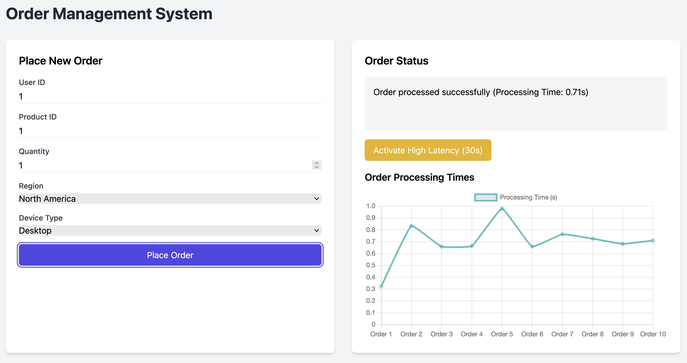
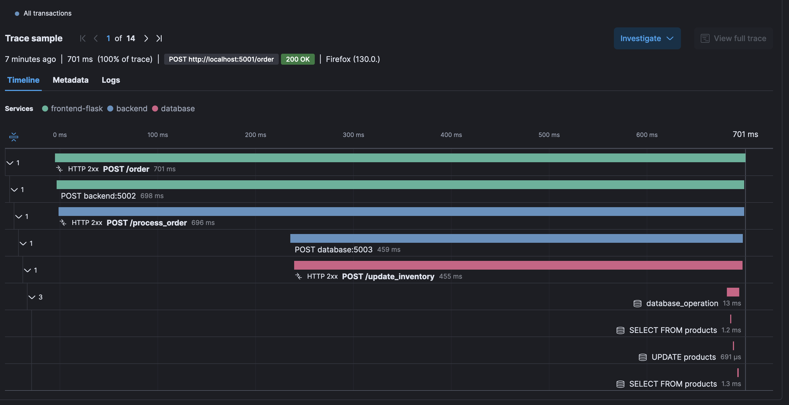
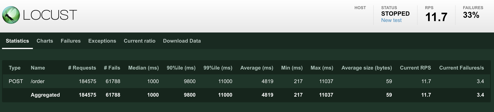

# Microservices Order Processing System with APM

This project demonstrates a microservices-based order processing system with Elastic APM integration for performance monitoring and distributed tracing.



## Architecture

The system consists of the following components:

1. Frontend (Flask and Node.js versions)
2. Backend (Python Flask)
3. Database Service (Python Flask with PostgreSQL)
4. Elastic APM Server
5. PostgreSQL Database
6. Locust (for load testing)

## Features

- Dual frontend implementations (Flask and Node.js) for comparison
- RESTful API for order processing
- Distributed tracing with Elastic APM
- High latency simulation for testing and monitoring
- Comprehensive logging
- Load testing with Locust

## Prerequisites

- Docker and Docker Compose
- Node.js (for Node.js frontend)
- Python 3.8+
- Elastic APM Server (can be set up separately or as part of an Elastic Stack)

## Setup

1. Clone the repository:
   ```
   git clone flask-apm-demo
   cd flask-apm-demo
   ```

2. Create a `.env` file in the root directory with the following content:
   ```
   ELASTIC_CLOUD_HOST=
   ELASTIC_API_KEY=
   FLEET_ENROLLMENT_TOKEN=
   FLEET_URL=

   ELASTIC_APM_SECRET_TOKEN=
   ELASTIC_APM_SERVER_URL=
   ```

3. Build and start the services:
   ```
   docker-compose up --build
   ```

## Usage

### Placing an Order

Send a POST request to either frontend service:

- Flask Frontend: `http://localhost:5001/order`
- Node.js Frontend: `http://localhost:5004/order`

Example request body:
```json
{
  "user_id": "user123",
  "product_id": "prod456",
  "product_name": "Sample Product",
  "quantity": 2,
  "price": 19.99,
  "region": "North America",
  "device_type": "Desktop"
}
```

## Viewing Traces



1. **Access Kibana**:
   - Log in to your Elastic Cloud account.
   - Go to your deployment and click on "Launch Kibana".

2. **Navigate to APM**:
   - In Kibana, click on "APM" in the left sidebar.

3. **Select Your Service**:
   - You should see your services listed (e.g., "frontend-flask", "frontend-nodejs", "backend").
   - Click on the service you want to investigate.

4. **Find `/order` Transactions**:
   - In the "Transactions" tab, look for "POST /order" transactions.
   - Click on a transaction to view its details.

## Analyzing `/order` Traces

When analyzing a trace for the `/order` API:

1. **Transaction Overview**:
   - View the overall response time and result (success/error).

2. **Distributed Tracing**:
   - Observe how the request flows from the frontend through the backend to the database.
   - Look for any gaps or unexpected delays between services.

3. **Spans**:
   - Examine individual spans to see where time is spent:
     - Frontend processing
     - Network time to backend
     - Backend processing
     - Database queries

4. **High Latency Detection**:
   - For requests with the `X-High-Latency` header, you should see longer durations in specific spans.

5. **Error Analysis**:
   - If a transaction failed, look for error messages and stack traces.

6. **Custom Context**:
   - Check the "Custom" tab in the transaction details to see additional context like `user_id`, `product_id`, etc.

7. **Service Map**:
   - Use the Service Map view to visualize the flow between services for `/order` requests.

## Tips for Effective Tracing

- Use unique `user_id` or `order_id` values to easily find specific transactions.
- Compare traces between normal and high-latency requests to understand performance impacts.
- Look for patterns in slow transactions – are they related to specific products, regions, or times?
- Use the "Compare" feature in Kibana to analyze differences between fast and slow transactions.

## Troubleshooting

- If traces are not appearing, check that your APM server URL and secret token are correctly set.
- Ensure all services (frontend, backend, database) are properly instrumented with the APM agent.
- Verify that the APM server is reachable from your application services.


### Simulating High Latency

Add the `X-High-Latency: true` header to your request to simulate high latency scenarios.

### Health Check

Access the health check endpoint:
- Flask Frontend: `http://localhost:5001/health`
- Node.js Frontend: `http://localhost:5004/health`

### Load Testing

Access the Locust web interface at `http://localhost:8089` to perform load testing. The default URL will send request to both flask frontend and python frontend through load-balancing 




### Nginx as Reverse Proxy and Load Balancer

Nginx serves as a reverse proxy and load balancer for our frontend services. It distributes incoming requests between the Flask and Node.js frontend instances, providing several benefits:

- **Load Distribution**: Evenly distributes traffic between the two frontend services, preventing any single instance from becoming overwhelmed.
- **High Availability**: If one frontend service goes down, Nginx can route all traffic to the remaining healthy instance.
- **SSL Termination**: Nginx can handle SSL/TLS encryption, offloading this task from the application servers.
- **Simplified Architecture**: Clients only need to know the Nginx server's address, not the individual frontend services.

The Nginx configuration uses a round-robin algorithm by default to distribute requests between the Flask and Node.js frontends.


## Monitoring

Access your Elastic APM dashboard to view performance metrics, distributed traces, and error logs.

## Development

### Frontend (Flask)

Located in `./frontend-flask/app.py`

### Frontend (Node.js)

Located in `./frontend-nodejs/app.js`

### Backend

Located in `./backend/app.py`

### Database Service

Located in `./database/app.py`

## Logging

Logs are written to:
- Frontend Flask: `/var/log/frontend.log`
- Frontend Node.js: `/var/log/frontend.log`
- Backend: `/var/log/backend.log`
- Database Service: `/var/log/database.log`

## Troubleshooting

1. If services fail to start, check Docker logs:
   ```
   docker-compose logs [service-name]
   ```

2. Ensure all required environment variables are set in the `.env` file.

3. Verify that the Elastic APM server is accessible from your services.

## Load Testing with Locust

This project includes a Locust file for load testing the order processing system. Locust is a user-friendly, scriptable and scalable performance testing tool.

### Locust File Overview

The `locustfile.py` is located in the `locust` directory and defines the behavior of simulated users for load testing. Here's an overview of its key components:

```python
class OrderUser(HttpUser):
    wait_time = between(1, 5)  # Wait 1-5 seconds between tasks

    @task(1)
    def place_order(self):
        # Simulates normal order placement

    @task(2)
    def place_order_broken(self):
        # Simulates problematic order placement

    @task(3)
    def place_order_sluggish(self):
        # Simulates high-latency order placement
```

#### Key Features:

1. **Normal Order Placement**: Simulates standard order processing.
2. **Problematic Order Placement**: Tests the system's error handling with potentially invalid data.
3. **High-Latency Order Placement**: Simulates slow order processing to test system behavior under delay.

### Task Weighting

- Normal orders have a weight of 1
- Problematic orders have a weight of 2
- High-latency orders have a weight of 3

This distribution ensures that the system is tested more heavily with edge cases and performance-critical scenarios.

### Running Load Tests

1. Ensure all services are up and running.
2. Start Locust:
   ```
   docker-compose up locust
   ```
3. Access the Locust web interface at `http://localhost:8089`.
4. Set the number of users to simulate and the spawn rate.
5. Start the test and monitor the results in real-time.

### Interpreting Results

- **Response Time**: Monitor how response times change as load increases.
- **Error Rate**: Check for any errors, especially with the "broken" order placement task.
- **Requests Per Second**: Observe how many requests your system can handle.
- **High-Latency Behavior**: Pay special attention to how your system performs during simulated high-latency scenarios.

### Customizing Tests

You 

## Contributing

Please read CONTRIBUTING.md for details on our code of conduct and the process for submitting pull requests.

## License

This project is licensed under the MIT License - see the LICENSE.md file for details.
